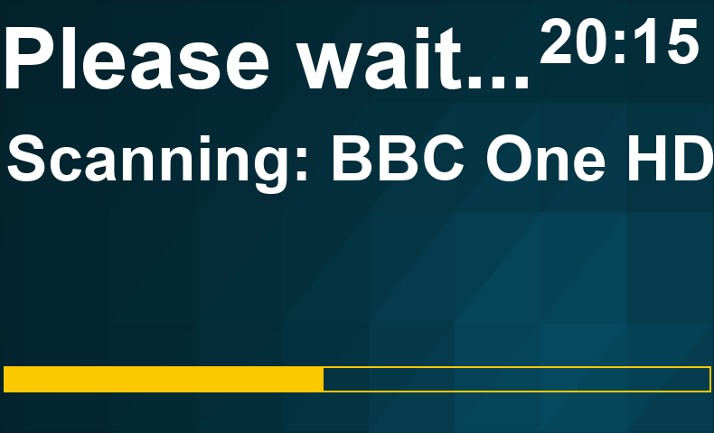
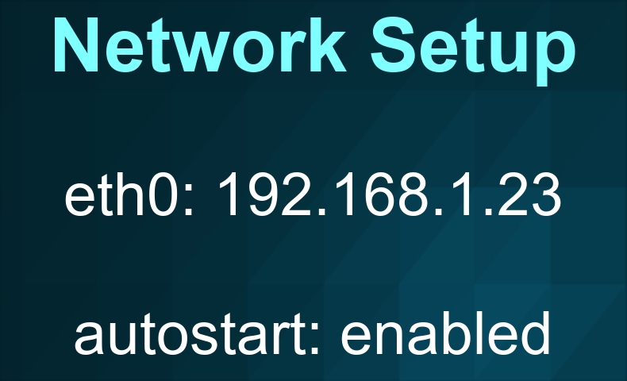
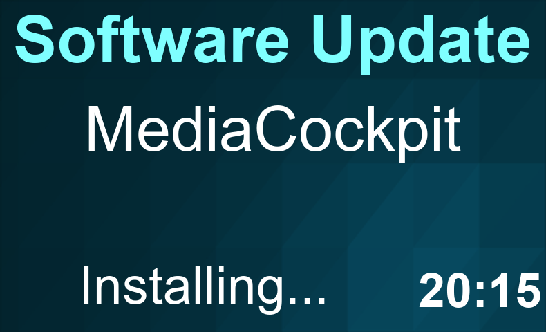
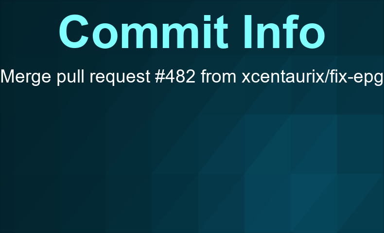
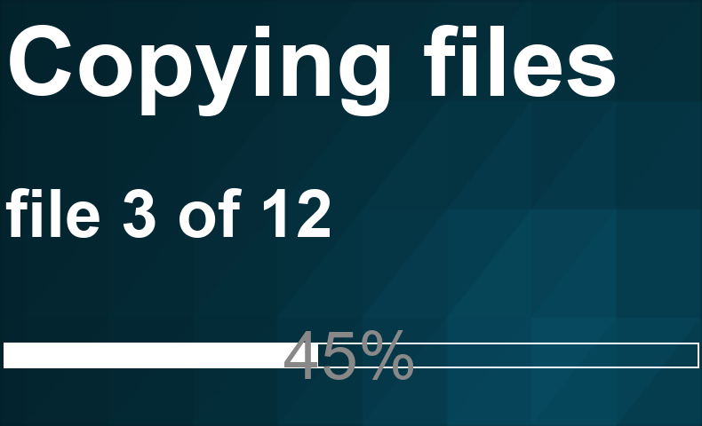

# LCD Skin Gallery

Rendered mockups of every screen defined in `src/skin/skin_display.xml` and
`src/skin/skin_display_templates.xml`, at the panel's native 790x480
resolution. Content is placeholder sample data (channel names, times, menu
entries, etc.) standing in for what Enigma2 fills in at runtime - this is a
static preview of the layout, not a live capture from a device. Click any
thumbnail for the full-size image.

## Live TV

<figure><figcaption><code>InfoBarSummary</code></figcaption></figure>
<figure><figcaption><code>InfoBarMoviePlayerSummary</code></figcaption></figure>

## Channel Selection & EPG

<figure><figcaption><code>ChannelSelectionSummary</code></figcaption></figure>
<figure><figcaption><code>ChannelSelectionRadioSummary</code></figcaption></figure>
<figure><figcaption><code>GraphicalEPGPIGSummary</code> also used as-is by <code>GraphicalEPGSummary</code>, <code>GraphicalInfoBarEPGSummary</code>, <code>EPGSelectionMultiSummary</code>, <code>EPGSelectionSummary</code></figcaption></figure>
<figure><figcaption><code>EventViewSimpleSummary</code> also used as-is by <code>EventViewSummary</code></figcaption></figure>

## Recordings & Timers

<figure><figcaption><code>ServiceScanSummary</code></figcaption></figure>
<figure><figcaption><code>TimerEditListSummary</code></figcaption></figure>
<figure><figcaption><code>PowerTimerEditListSummary</code></figcaption></figure>
<figure><figcaption><code>AutoTimerOverviewSummary</code></figcaption></figure>

## Menus & Dialogs

<figure><figcaption><code>MenuSummary</code></figcaption></figure>
<figure><figcaption><code>ChoiceBoxSummary</code></figcaption></figure>
<figure><figcaption><code>MessageBoxSummary</code> also used as-is by <code>MessageBoxSimpleSummary</code>, <code>MessageBoxWizardSummary</code></figcaption></figure>
<figure><figcaption><code>ScreenSummary</code> generic fallback title screen</figcaption></figure>
<figure><figcaption><code>WizardSummary</code></figcaption></figure>
<figure><figcaption><code>LanguageWizardSummary</code></figcaption></figure>
<figure><figcaption><code>LanguageSelectionSummary</code></figcaption></figure>

## Setup & Configuration

<figure><figcaption><code>SetupSummary</code></figcaption></figure>
<figure><figcaption><code>SkinSelectorSummary</code></figcaption></figure>
<figure><figcaption><code>NetworkServicesSummary</code></figcaption></figure>
<figure><figcaption><code>NimSelectionSummary</code></figcaption></figure>
<figure><figcaption><code>InputDeviceSelectionSummary</code></figcaption></figure>
<figure><figcaption><code>PackageManagerSummary</code></figcaption></figure>
<figure><figcaption><code>PluginBrowserSummary</code></figcaption></figure>
<figure><figcaption><code>UpdatePluginSummary</code></figcaption></figure>
<figure><figcaption><code>CommitInfoSummary</code></figcaption></figure>
<figure><figcaption><code>ServiceInfoSummary</code></figcaption></figure>

## Movies & Extensions

<figure><figcaption><code>MovieSelectionSummary</code></figcaption></figure>
<figure><figcaption><code>MovieContextMenuSummary</code></figcaption></figure>
<figure><figcaption><code>NumberZapSummary</code></figcaption></figure>
<figure><figcaption><code>IMDbLCDScreen</code></figcaption></figure>
<figure><figcaption><code>JobViewSummary</code></figcaption></figure>
<figure><figcaption><code>EtPortalScreenSummary</code></figcaption></figure>
<figure><figcaption><code>AboutSummary</code></figcaption></figure>

## Standby

<figure><figcaption><code>StandbySummary</code></figcaption></figure>

