# DisplayCockpit Gallery

Screens from `src/skin/skin_display.xml` and `src/skin/skin_display_templates.xml`,
at the panel's native 396x240 resolution. Every image here is a real
screenshot grabbed on-device.

|  |  |  |  |
|:---:|:---:|:---:|:---:|
| 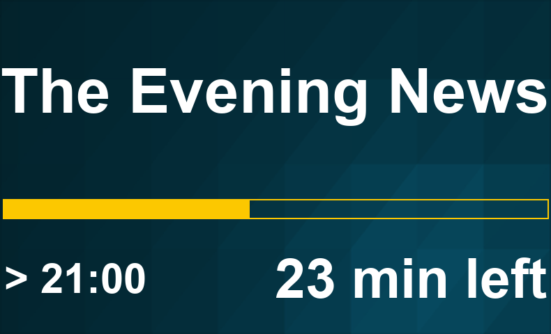 | 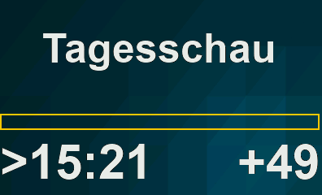 |  |  |

|  |  |  |  |
|:---:|:---:|:---:|:---:|
| 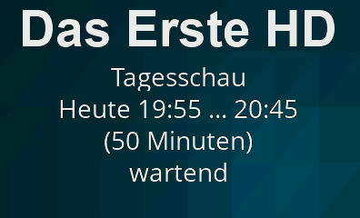 | 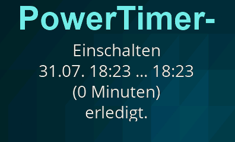 | 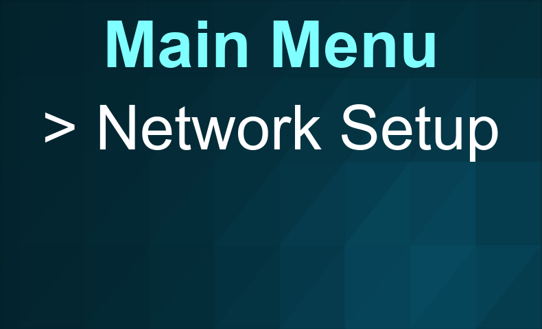 |  | |

|  |  |  |  |
|:---:|:---:|:---:|:---:|
|  |  | 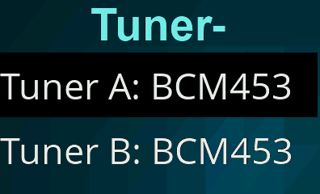 | 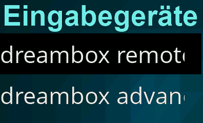 |
|  | 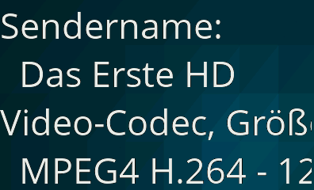 | 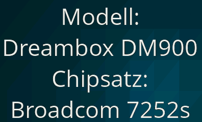 | 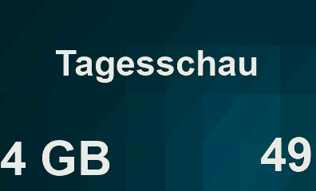 | 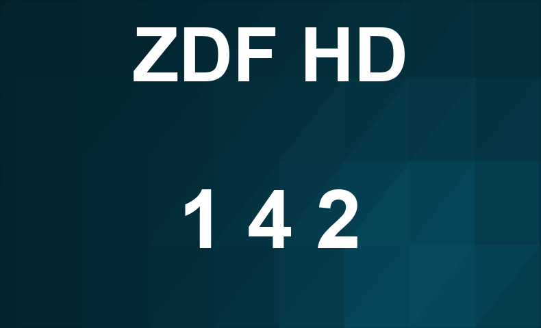  |
